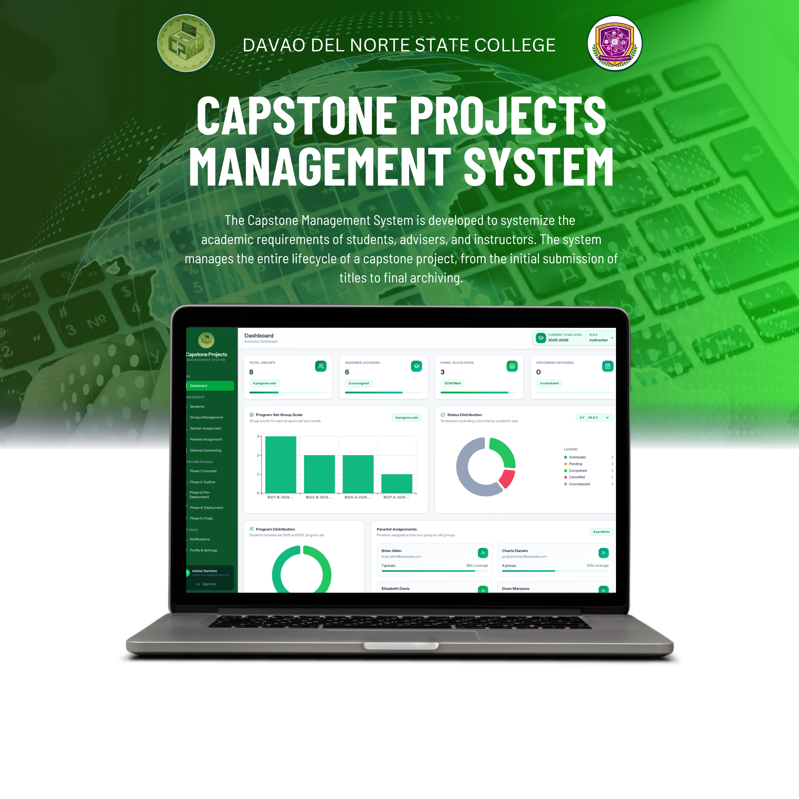
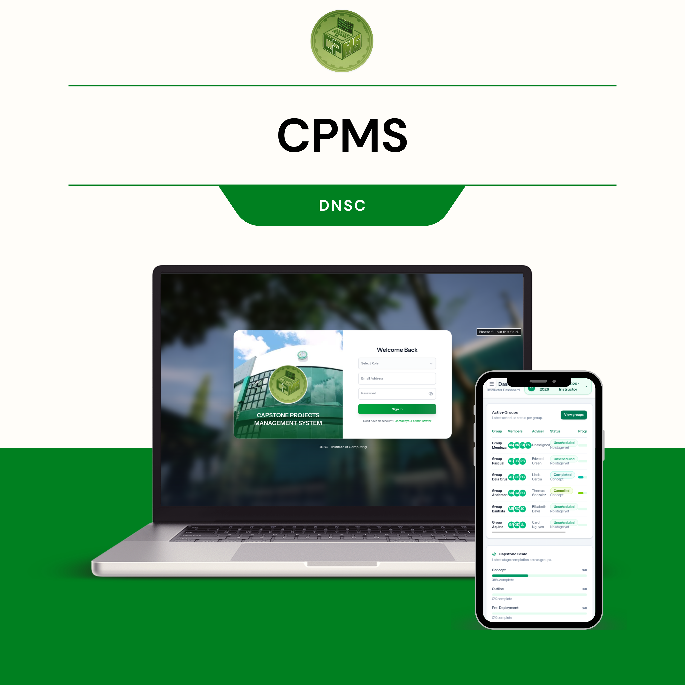

# Capstone Projects Management System (CPMS)

A centralized platform for Davao del Norte State College to manage the full capstone lifecycle. CPMS streamlines how students, advisers, and instructors collaborate from initial concept submission through review, revisions, approvals, and final archiving. It provides role-based workflows, program set organization, and academic year tracking so capstone delivery is structured, transparent, and measurable.

**Concept**
CPMS is built to remove the friction in capstone coordination. It organizes students into groups, links them with advisers, and provides a clear submission and review trail for capstone artifacts. The system focuses on a clean, green-themed UI and concise workflows to reduce administrative overhead and help students ship quality projects.

**Key Capabilities**
- Group management with adviser assignment and reassignment flows.
- Concept submission review with approve, request revision, and reject actions.
- Program set and academic year organization for cohort-based tracking.
- Role-based views for students, advisers, and instructors.
- Consistent, modal-driven UI for confirmations and approvals.

**Tech Stack (Based on This Repository)**
- Backend: Laravel 12, PHP 8.2+, Inertia.js v2, Laravel Wayfinder.
- Frontend: React 19, TypeScript, Tailwind CSS 4, Vite.
- UI/UX: MUI, Framer Motion, Lucide Icons.
- Tooling: ESLint, Prettier, Laravel Pint, Pest.
- Data: Relational database via Laravel Eloquent (configured in `.env`).

**Project Structure**
- `app/` Laravel application logic (controllers, models, policies).
- `routes/` HTTP routes for web and role-specific modules.
- `resources/js/pages/` Inertia React pages per role.
- `resources/js/components/` Shared React components and modals.
- `database/` Migrations, factories, and seeders.
- `public/` Static assets.
- `tests/` Pest tests.

**Local Development**
- Install dependencies and build assets: `composer run setup`.
- Run the app with Vite and queue worker: `composer run dev`.

Setup & Configuration
Prerequisites
Make sure the following are installed on your machine before getting started:
Tool
Version
Purpose
Docker Desktop
Latest
Runs PHP, MySQL, and related services
Node.js
20+ (LTS)
Frontend asset compilation via npm
Git
Latest
Source control
Note: PHP and Composer do not need to be installed locally. All PHP operations run through Docker.
1. Clone the Repository
git clone https://github.com/your-org/cpms.git
cd cpms
2. Environment Configuration
Copy the example environment file and configure it for your local setup:
cp .env.example .env
Open .env and update the following values:
APP_NAME="Capstone Projects Management System"
APP_ENV=local
APP_KEY=                        # Generated in a later step
APP_DEBUG=true
APP_URL=http://localhost:8000

# Database — must match Docker service credentials below
DB_CONNECTION=mysql
DB_HOST=mysql                   # Docker service name
DB_PORT=3306
DB_DATABASE=cpms
DB_USERNAME=cpms_user
DB_PASSWORD=secret

# Queue (for background jobs)
QUEUE_CONNECTION=database

# Cache
CACHE_STORE=database
3. Docker Services
The project uses Docker to run PHP-FPM, MySQL, and a queue worker. The compose file is located at the project root.
docker-compose.yml (reference)
services:
  app:
    build:
      context: .
      dockerfile: Dockerfile
    container_name: cpms_app
    restart: unless-stopped
    working_dir: /var/www
    volumes:
      - .:/var/www
    networks:
      - cpms_network

  webserver:
    image: nginx:alpine
    container_name: cpms_nginx
    restart: unless-stopped
    ports:
      - "8000:80"
    volumes:
      - .:/var/www
      - ./docker/nginx/default.conf:/etc/nginx/conf.d/default.conf
    depends_on:
      - app
    networks:
      - cpms_network

  mysql:
    image: mysql:8.0
    container_name: cpms_mysql
    restart: unless-stopped
    environment:
      MYSQL_DATABASE: cpms
      MYSQL_USER: cpms_user
      MYSQL_PASSWORD: secret
      MYSQL_ROOT_PASSWORD: root_secret
    ports:
      - "3307:3306"             # host:container (use 3307 to avoid local conflicts)
    volumes:
      - cpms_mysql_data:/var/lib/mysql
    networks:
      - cpms_network

  queue:
    build:
      context: .
      dockerfile: Dockerfile
    container_name: cpms_queue
    restart: unless-stopped
    working_dir: /var/www
    command: php artisan queue:work --sleep=3 --tries=3
    volumes:
      - .:/var/www
    depends_on:
      - mysql
    networks:
      - cpms_network

networks:
  cpms_network:
    driver: bridge

volumes:
  cpms_mysql_data:
Build and start all services
docker compose up -d --build
Verify all containers are running:
docker compose ps
You should see cpms_app, cpms_nginx, cpms_mysql, and cpms_queue with a status of Up.
4. Install PHP Dependencies
Run Composer inside the app container:
docker compose exec app composer install
Generate the application key:
docker compose exec app php artisan key:generate
5. Install Node.js Dependencies
Run npm on your host machine (not inside Docker):
npm install
6. Database Migration & Seeding
Run migrations inside the Docker container to set up the database schema:
docker compose exec app php artisan migrate
To also seed the database with initial/demo data:
docker compose exec app php artisan migrate --seed
To reset and re-run all migrations from scratch:
docker compose exec app php artisan migrate:fresh --seed
7. Running the Application
Start backend (Docker services)
docker compose up -d
Start frontend dev server (Vite)
On your host machine:
npm run dev
The application will be available at http://localhost:8000.
Vite HMR (Hot Module Replacement) runs on http://localhost:5173 and is proxied automatically.
All-in-one (using Composer scripts)
Alternatively, use the built-in Composer scripts after Docker is running:
# Install all dependencies and build assets
docker compose exec app composer run setup

# Start the app with Vite and queue worker
docker compose exec app composer run dev
8. Building for Production
Compile and optimize all frontend assets:
npm run build
Then run the app in production mode via Docker with:
APP_ENV=production docker compose up -d
Make sure to also cache Laravel config and routes for better performance:
docker compose exec app php artisan config:cache
docker compose exec app php artisan route:cache
docker compose exec app php artisan view:cache
Common Docker Commands
Action
Command
Start all services
docker compose up -d
Stop all services
docker compose down
Rebuild containers
docker compose up -d --build
View container logs
docker compose logs -f app
Open a shell in app container
docker compose exec app bash
Run an Artisan command
docker compose exec app php artisan <command>
Run Composer
docker compose exec app composer <command>
Access MySQL CLI
docker compose exec mysql mysql -u cpms_user -psecret cpms
Reset database
docker compose exec app php artisan migrate:fresh --seed
Useful Artisan Commands
# Generate application key
docker compose exec app php artisan key:generate

# Run all migrations
docker compose exec app php artisan migrate

# Rollback last migration batch
docker compose exec app php artisan migrate:rollback

# Seed the database
docker compose exec app php artisan db:seed

# Clear all caches
docker compose exec app php artisan optimize:clear

# List all routes
docker compose exec app php artisan route:list

# Run Pest tests
docker compose exec app php artisan test
Troubleshooting
Port conflict on 8000 or 3307
Change the host port mappings in docker-compose.yml under the ports key for webserver or mysql.
.env changes not reflecting
Clear the config cache inside the container:
docker compose exec app php artisan config:clear
MySQL connection refused
Ensure the DB_HOST in .env is set to mysql (the Docker service name), not 127.0.0.1 or localhost.
npm run dev not finding the app
Make sure docker compose up -d is running before starting Vite. Vite needs the Laravel backend available at APP_URL.
Vite assets not loading in browser
Confirm VITE_APP_URL or APP_URL in .env matches the port your Nginx container exposes (default http://localhost:8000).
Permission errors on storage or cache
Fix file permissions inside the container:
docker compose exec app chmod -R 775 storage bootstrap/cache
docker compose exec app chown -R www-data:www-data storage bootstrap/cache